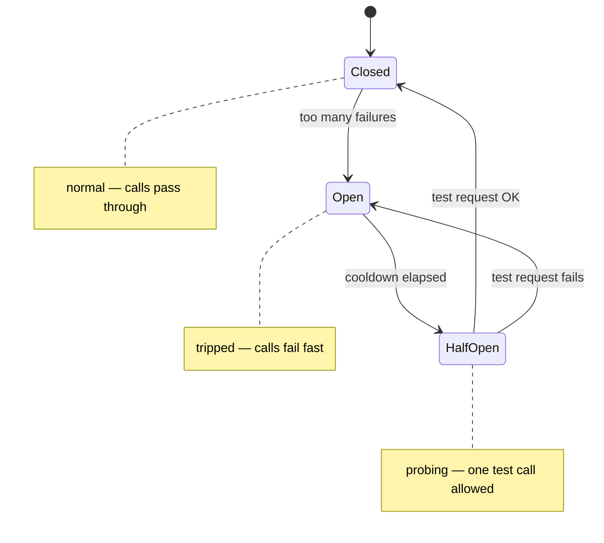
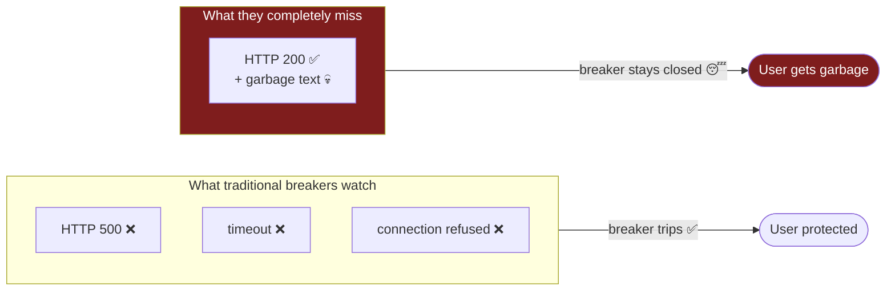

# 1. The Problem

[← Back to index](README.md) · [Next: Architecture Overview →](02-architecture-overview.md)

---

## Start with how normal software fails

When a normal web service breaks, it breaks **loudly**. You ask it for
something and you get back an error: `HTTP 500 Internal Server Error`, a
timeout, a refused connection. The failure is *measurable*. A machine can look
at the response and say with certainty: "that was a failure."

Because failures are loud and measurable, engineers built tools that watch for
them. The most famous is the **[circuit breaker](05-glossary.md#circuit-breaker)**.

### The circuit breaker analogy

It's named after the breaker in your house's electrical panel. If too much
current flows (a fault), the breaker **trips** (opens) and cuts the circuit, so
your house doesn't catch fire. Once things are safe, you flip it back (it
closes).

In software, a circuit breaker wraps a call to some other service. It counts
failures. If too many calls fail in a row, it **"opens"** — and for a while it
stops even trying to call that service. It just instantly fails, or returns a
backup answer. This protects you two ways:

1. You stop hammering a service that's already on fire (giving it room to recover).
2. Your own users get a fast "no" instead of waiting 30 seconds for a timeout.

After a cooldown, the breaker lets *one* test request through ("half-open"). If
that works, it **closes** again and normal traffic resumes.

Every resilience library you've heard of — **Resilience4j** (Java),
**tenacity** (Python), **Polly** (.NET), every `@retry` decorator — has a
circuit breaker. They all watch for the same thing: **transport failures**.
Network-level problems. The loud, measurable kind.

---

## Now: how LLMs fail

Here's the twist. A **[Large Language Model](05-glossary.md#llm-large-language-model)**
(the AI behind ChatGPT, Claude, Llama, etc.) has a failure mode that normal
services don't have.

**It can fail while looking completely healthy.**

The server is up. The network is fine. The response comes back fast, with a
cheerful `HTTP 200 OK`. By every measure a traditional circuit breaker cares
about, *nothing is wrong*. But the actual text inside the response is garbage:

- **A refusal loop:** *"As an AI language model, I cannot assist. As an AI
  language model, I cannot assist. As an AI language model, I cannot…"* repeated
  ten times.
- **A repetition loop:** the model gets stuck and repeats the same phrase
  forever.
- **Off-topic rambling:** you asked about databases, it's talking about the
  weather.
- **Wrong language:** you asked in English, it answered in Chinese.
- **A collapsed answer:** you asked a real question, it said "ok." and stopped.

This is called a **[brownout](05-glossary.md#brownout)** — borrowing the word
for when the electrical grid doesn't go fully dark but the voltage sags and your
lights dim. The model isn't *down*. It's *degraded*. And it's lying to you with
a 200 OK.

### Why this happens

LLMs degrade for boring, real reasons: the provider quietly swapped you to a
smaller model under load, a [quantized](05-glossary.md#quantized) version is being served to save GPU, the
context got truncated, a sampling parameter drifted, the model hit a bad region
of its probability distribution. You usually can't see *why* from the outside —
you only see the bad text.

---

## The gap, stated plainly

A traditional circuit breaker checks the **envelope** (did the network deliver
a response?). It never opens the envelope to check whether the **letter inside**
makes sense. For a normal API that's fine — a 200 means success. For an LLM, a
200 means "a response arrived," and says nothing about whether it's usable.

---

## What AgentShield adds

AgentShield introduces a **second** circuit breaker that runs alongside the
traditional one. It is called the
**[semantic circuit breaker](05-glossary.md#semantic-circuit-breaker)**
("semantic" = *relating to meaning*). Instead of watching the network, it reads
the actual text the model produced and scores its quality. If the quality keeps
dropping, *this* breaker trips — even though the network breaker stays closed
because the network was never the problem.

When it trips, AgentShield doesn't just fail. It reroutes the request through a
chain of backups (a cheaper model, then a cache of past good answers, and only
as a last resort a polite "try again" message), so the user gets something
useful instead of garbage.

That dual-breaker idea — **one breaker for the network, one for the content,
running independently** — is the heart of the project. The next page shows how
it's wired together.

---

## The three failure modes, mapped

The TrueFoundry challenge brief names three failures. Here's how the problem
above maps to all three:

| Failure mode | Is the server up? | Is the text good? | Who catches it |
|---|---|---|---|
| **LLM down** | ❌ No | (no text at all) | Transport breaker (traditional) |
| **LLM brownout** | ✅ Yes | ❌ No | **Semantic breaker (new)** |
| **MCP tool erroring** | ❌ tool is down | (tool result missing) | Per-tool breaker |

AgentShield is the only entry in this track that has an answer for the **middle
row**.

---

[← Back to index](README.md) · [Next: Architecture Overview →](02-architecture-overview.md)
