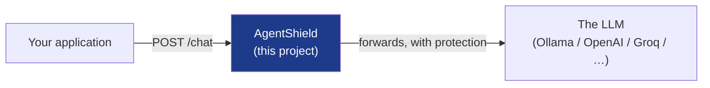
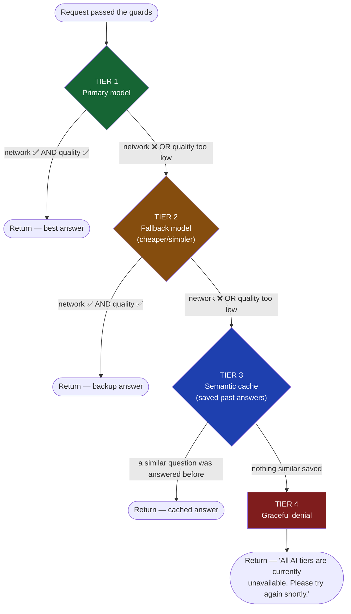
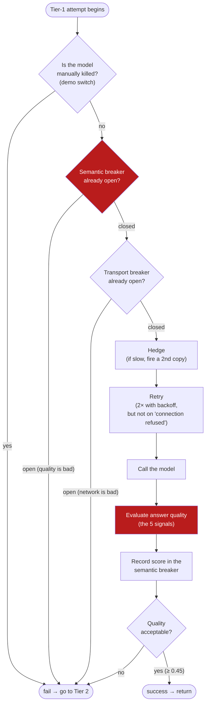

# 2. Architecture Overview

[← Previous: The Problem](01-the-problem.md) · [Back to index](README.md) · [Next: The Two Circuit Breakers →](03-two-circuit-breakers.md)

---

AgentShield is a single **Go** program that sits **between your application and
your LLM**. Your app talks to AgentShield exactly like it would talk to OpenAI;
AgentShield does the talking to the actual model and adds all the protection in
between.



That "in between" position is what lets it add safety without your app changing
anything. To your app it's just an LLM endpoint.

---

## The protection comes in two stages

Stage 1 protects the **system** (don't let traffic overwhelm you). Stage 2
protects the **answer quality** (don't let the user get garbage). They run in
order.

### Stage 1 — Traffic guards (the "before we even try" layer)

Before AgentShield calls any model, two guards decide whether the request
should proceed *at all*:

| Guard | Plain English | Why |
|---|---|---|
| **[Load shedder](05-glossary.md#load-shedding)** | "We're too busy right now — reject this one fast." | Better to cleanly reject 5% of traffic than to slow down 100% of it into a death spiral. Uses an **[AIMD](05-glossary.md#aimd)** algorithm — the same maths that stops the internet from collapsing under congestion. |
| **[Bulkhead](05-glossary.md#bulkhead)** | "Only N requests may be in flight at once; the rest wait." | Named after a ship's watertight compartments: if one floods, the whole ship doesn't sink. Caps concurrency so one burst can't exhaust memory. Separate limits for interactive (20) vs batch (5) traffic. |

### Stage 2 — The 4-tier degradation chain (the "try, and fall back" layer)

This is the core. A request tries to get a good answer from **the best source
first**, and if that fails it **falls down** to the next-best source. Four
tiers, in order:



The key insight: **the user always gets *something* usable.** Even in the worst
case (every model down, cache empty), they get a clear, polite message instead
of a stack trace or a hung request. That last tier — **[graceful
denial](05-glossary.md#graceful-denial)** — is what turns "the system crashed"
into "the system is briefly busy."

#### What each tier is for

| Tier | Source | When it's used | Cost / speed |
|---|---|---|---|
| 1 · Primary | Your best model (e.g. Llama 70B, GPT-4o) | Always tried first | Slowest, most expensive, best quality |
| 2 · Fallback | A cheaper, smaller model (e.g. Llama 8B) | When primary fails or its answer is low-quality | Faster, cheaper, "good enough" |
| 3 · Cache | Answers we saved from earlier requests | When both models are unreachable | Instant, free |
| 4 · Denial | A fixed polite message | Only when everything else is exhausted | Instant, free, no real answer |

> The cache is **[semantic](05-glossary.md#semantic-cache)**, not exact. It
> matches questions by *meaning*, not by exact text — so "What is Go?" and
> "Explain Golang" can hit the same cached answer. More on that in the
> [glossary](05-glossary.md#semantic-cache).

---

## Inside Tier 1: the protections stacked on the primary model

Tier 1 isn't a single call — it's the primary model wrapped in several layers of
protection, applied in this order. (Tier 2 is similar but lighter — no hedging,
because the fallback's whole job is to be fast.)



Two protections worth naming here, because their names sound fancier than the
ideas:

- **[Hedging](05-glossary.md#hedged-request):** if the primary call is taking
  too long (past 1.5s), fire a *second, identical* request and take whichever
  finishes first. This shaves off the unlucky-slow "tail" requests. (Like
  asking two people the same question when the first is taking forever.)
- **[Retry with backoff](05-glossary.md#retry--backoff):** if a call fails,
  try again — but wait a bit longer each time (300ms, then 600ms…) so you don't
  pile on. With one important exception: if the error is "connection refused"
  (the server is simply *not there*), retrying is pointless and just wastes
  time, so AgentShield skips straight to the next tier.

Notice **where the quality check sits**: *after* the transport breaker, not
inside it. This is deliberate and is the subject of the next page — it's what
keeps the two breakers independent.

---

## The supporting cast

Beyond the request path, AgentShield ships the things a real production service
needs:

| Component | What it does | Glossary |
|---|---|---|
| **ReAct agent** | Lets the LLM use *tools* (calculator, clock, an external data source) in a reason→act→observe loop. Each tool has its *own* circuit breaker. | [ReAct](05-glossary.md#react-reason--act), [MCP](05-glossary.md#mcp-model-context-protocol) |
| **Resilience Score** | One number, 0–100, summarizing overall health (5 components × 20 points). For the operator's at-a-glance dashboard. | [Resilience Score](05-glossary.md#resilience-score) |
| **Metrics + Traces** | **[Prometheus](05-glossary.md#prometheus)** metrics and **[OpenTelemetry](05-glossary.md#opentelemetry-otel)** traces so you can see, per request, exactly which tier served it and why. | [Observability](05-glossary.md#observability) |
| **Dashboard** | A single web page (no build step) showing the score, live charts, and demo buttons to inject failures on purpose. | — |
| **Webhooks** | Calls an external URL when a breaker changes state, so your ops system gets alerted. | — |

---

## How it's split into code

AgentShield is **12 Go packages** with a clean, one-directional dependency graph
(no package depends on something that depends back on it). The important ones:

```
api/           ← HTTP endpoints, auth, rate limiting (the front door)
agent/         ← the public Ask / React / Stream surface + the ReAct loop + tools
orchestrator/  ← the 4-tier degradation chain + the streaming quality gate
quality/       ← the semantic breaker + the 5-signal quality evaluator  ★
provider/      ← pluggable LLM backends (Ollama, OpenAI-compatible)
cache/         ← the semantic cache
telemetry/     ← metrics, cost tracking, latency stats, the resilience score
memory/        ← per-process state: sessions, traces, score history
config/        ← all environment-variable reading lives here (nowhere else)
```

The single most important package to understand is `quality/` — that's where the
novel idea lives. The [next page](03-two-circuit-breakers.md) goes inside it.

---

[← Previous: The Problem](01-the-problem.md) · [Back to index](README.md) · [Next: The Two Circuit Breakers →](03-two-circuit-breakers.md)
