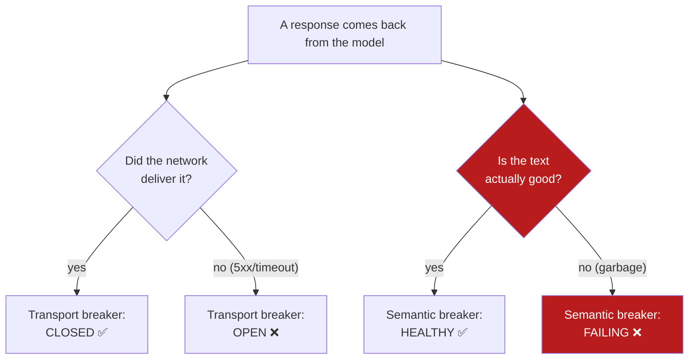
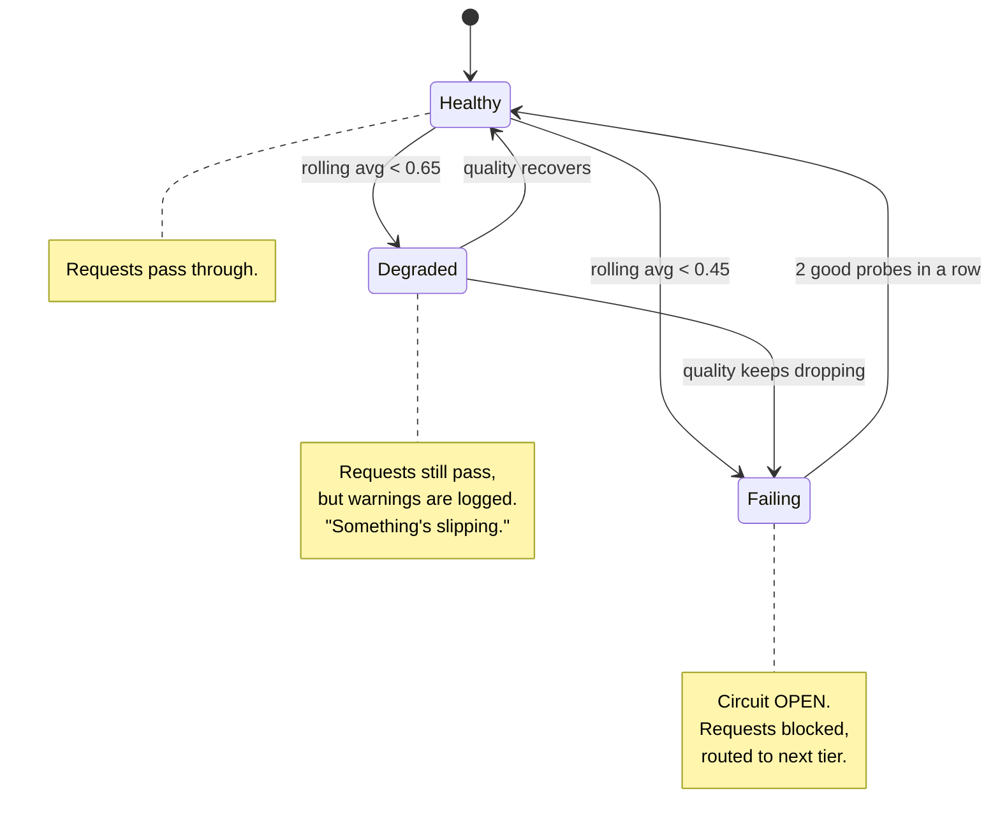
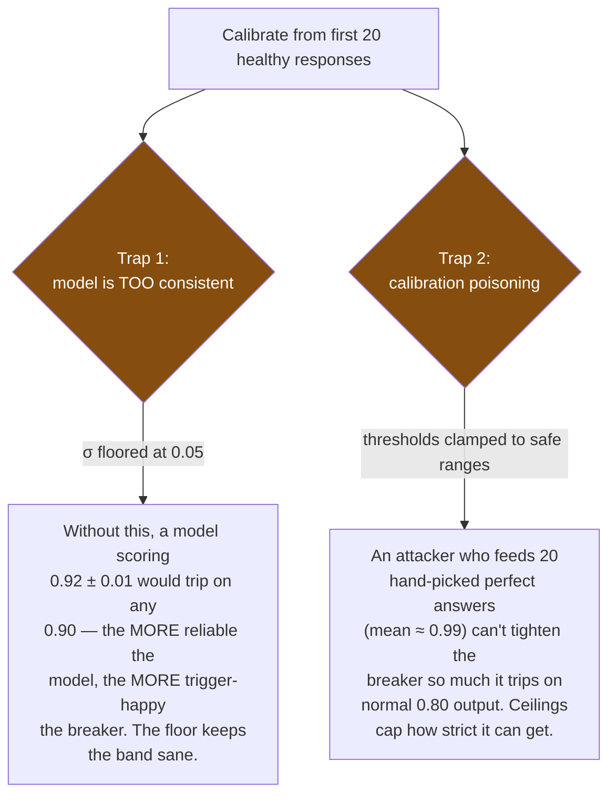

# 3. The Two Circuit Breakers

[← Previous: Architecture Overview](02-architecture-overview.md) · [Back to index](README.md) · [Next: Request Lifecycle →](04-request-lifecycle.md)

---

This is the page that explains the actual innovation. If you only understand one
diagram from this whole folder, make it this one:



Two questions, asked **independently**, about the *same* response. A response
can pass one and fail the other. That's the entire idea.

---

## Why two, and why independent

Each model in AgentShield (primary and fallback) has **two** circuit breakers
running side by side:

| Breaker | Watches | Trips when | Already existed elsewhere? |
|---|---|---|---|
| **Transport** | the network / HTTP layer | too many `5xx`, timeouts, refused connections | ✅ Yes — every resilience library has this |
| **Semantic** ★ | the *content* of the answer | answer quality keeps dropping | ❌ No — this is AgentShield's contribution |

Here's the table that makes the independence click. These are four genuinely
different situations, and you need both breakers to tell them apart:

| Situation | Transport breaker | Semantic breaker |
|---|---|---|
| Everything's fine | `closed` ✅ | `healthy` ✅ |
| Model server is **down** | **`open`** ❌ | `healthy` ✅ |
| Model is up but **spewing garbage** (brownout) | `closed` ✅ | **`failing`** ❌ |
| Both at once | **`open`** ❌ | **`failing`** ❌ |

Row 3 is the one a traditional setup gets *wrong*. The transport breaker says
"all good!" and the user gets the garbage. AgentShield's semantic breaker is the
only thing watching that row.

### The crucial design choice: quality check is *outside* the transport breaker

Look back at the Tier-1 diagram on the previous page. The order is:

```
transport breaker → call model → THEN evaluate quality → record in semantic breaker
```

The quality evaluation happens **after** the transport breaker has already
declared the network call a success. This is on purpose. If quality failures
were counted as transport failures, then a model returning *fast garbage* would
trip the *transport* breaker — which would be wrong, because the network was
perfectly healthy. Keeping them separate means each breaker's state always means
exactly what it says. (In the code, see the comment block above `tryPrimary` in
`orchestrator/orchestrator.go`.)

---

## How the semantic breaker scores "quality"

The semantic breaker doesn't call another AI to judge quality — that would be
slow, expensive, and circular. Instead it runs **five cheap, local checks**
(the "[quality signals](05-glossary.md#quality-signal)"), each looking for a
specific kind of brokenness. Each signal can subtract points from a perfect
score of `1.0`:

| Signal | What it catches | How | Max penalty |
|---|---|---|---|
| **Repetition** | looping / stuck output | counts repeated 3-word sequences ("[trigrams](05-glossary.md#trigram)") | −0.45 |
| **Length anomaly** | collapsed or runaway answers | compares length to a rolling baseline | −0.25 |
| **Refusal markers** | "As an AI language model, I cannot…" persona leaks | matches 9 known refusal phrases | −0.40 |
| **Coherence** | off-topic answers | measures meaning-overlap with the question using **[embeddings](05-glossary.md#embedding)** + **[cosine similarity](05-glossary.md#cosine-similarity)** | −0.20 |
| **Language mismatch** | answered in the wrong language | compares scripts (Latin vs CJK) | −0.30 |

The penalties stack, and the final score is clamped to the `[0, 1]` range. A
score below **0.45** (with at least one signal firing) is treated as a quality
failure, and the request falls through to the next tier.

> **Honest scope.** These signals catch *structural* brokenness — loops,
> refusals, off-topic, wrong-language, collapsed answers. They do **not** catch
> a fluent, confident, *factually wrong* answer (a "hallucination"). Detecting
> factual errors needs ground-truth lookup or entailment checks, which are
> outside what a fast local resilience layer can do. The project is deliberately
> upfront about this boundary — see the README's "Semantic Circuit Breaker"
> section.

---

## The three states (not two)

A normal circuit breaker has closed/open. The semantic breaker has **three**
states, because quality degrades *gradually* — it's useful to notice the slide
before it becomes a crash:



Two things to note:

- It judges on a **rolling average** of the last 8 scores, not a single bad
  response. One unlucky answer doesn't trip it; a *trend* does. (Thresholds:
  below 0.65 → degraded, below 0.45 → failing.)
- Recovery is cautious. Once **failing**, it waits a 20-second cooldown, then
  lets **one** probe request through (not a flood — that would re-overload a
  recovering model). It needs **two good probes in a row** to fully heal back to
  healthy.

---

## The clever bit: it tunes its own thresholds

A fixed threshold ("fail below 0.45") is fragile. Different models have
different "normal" quality scores. So the semantic breaker **calibrates itself**
to whatever model it's wrapping.

It watches the first **20 healthy responses**, computes their average quality
(`mean`) and how much they vary (`σ`, the [standard
deviation](05-glossary.md#standard-deviation-σ)), and sets:

- **degraded threshold** = `mean − 1σ`
- **failing threshold** = `mean − 2σ`

In words: "anything more than 2 standard deviations below this model's normal is
treated as failing." No manual tuning per model.

But naive calibration has two traps, and AgentShield closes both:



- **σ floor of 0.05** — stops an extremely consistent model from calibrating
  itself into a hair-trigger breaker.
- **Threshold clamps** (degraded stays within `[0.40, 0.80]`, failing within
  `[0.20, 0.60]`) — stops a [calibration-poisoning](05-glossary.md#calibration-poisoning)
  attacker from pre-seeding perfect samples to make the breaker over-strict.

It also does **drift detection**: it keeps a long-term average and, if the
model's quality permanently shifts by more than 0.20 from the original baseline,
flags that the calibration is stale.

(All of this lives in `quality/breaker.go` — the `calibrate()` function and the
comments around it walk through the exact reasoning.)

---

## The third breaker: per-tool, for the ReAct agent

There's actually one more circuit breaker, used in a different place. AgentShield
includes a **[ReAct](05-glossary.md#react-reason--act) agent** — an LLM that can
call *tools* (a calculator, a clock, an external data source over
**[MCP](05-glossary.md#mcp-model-context-protocol)**). Each tool gets its own
transport-style circuit breaker. So if an external tool's server starts erroring,
that *one tool* trips and the agent stops calling it, instead of hanging the
whole reasoning loop.

This is what covers the **third** failure mode in the challenge brief ("MCP
server erroring out"). The repo bundles a tiny mock MCP server
(`cmd/mcp-mock/`) with kill/restore switches so you can watch a tool's breaker
trip live in three failed calls.

---

[← Previous: Architecture Overview](02-architecture-overview.md) · [Back to index](README.md) · [Next: Request Lifecycle →](04-request-lifecycle.md)
