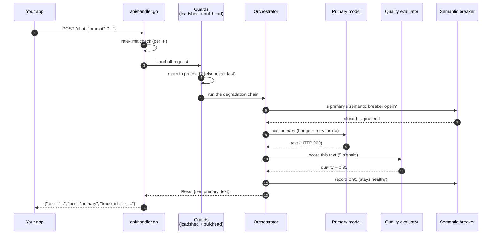
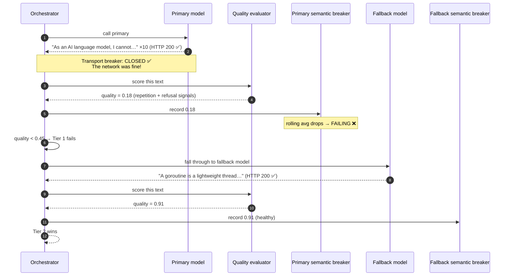
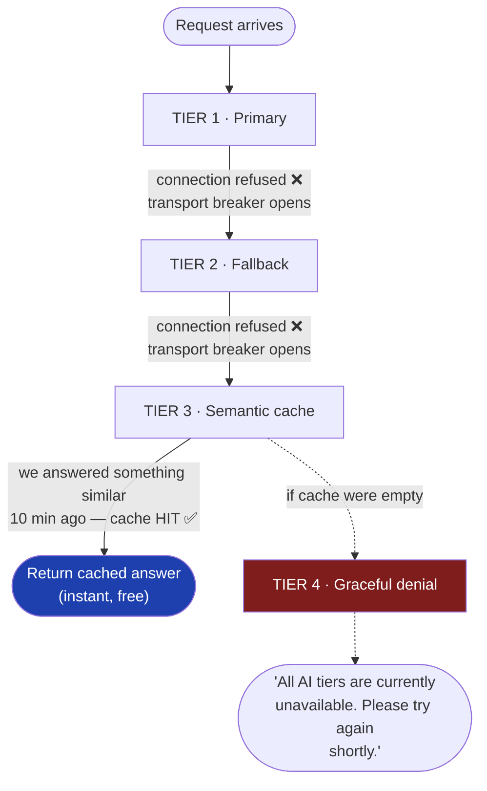

# 4. Request Lifecycle

[← Previous: The Two Circuit Breakers](03-two-circuit-breakers.md) · [Back to index](README.md) · [Next: Glossary →](05-glossary.md)

---

The earlier pages explained the parts. This page follows **one request** all the
way through, so you can see how the parts connect in time. We'll trace the same
prompt under three conditions: everything healthy, a brownout, and total
outage.

---

## The full path, end to end

Every step is recorded in a **[trace](05-glossary.md#trace)** with its own ID,
which is returned to the caller. You can later `GET /trace/{id}` to see exactly
what happened — which tiers were tried, what each one's quality score was, and
which breakers were in which state. That's the "[per-request resilience
trace](05-glossary.md#trace)" the dashboard visualizes as a timeline.

---

## Scenario A — Healthy (the happy path)

The diagram above *is* scenario A. The summary:

1. Request arrives, passes the rate-limit and traffic guards.
2. Primary model's semantic breaker is `healthy`, transport breaker is `closed`
   — proceed.
3. Primary returns a good answer (HTTP 200).
4. Quality evaluator scores it high (say 0.95).
5. Score recorded; breaker stays healthy.
6. **Tier 1 wins.** User gets the primary model's answer. Done in one hop.

---

## Scenario B — Brownout (the unique case)

Now the primary model is *up* but returning garbage — the brownout. Watch how
the two breakers diverge and the request *automatically* falls to the fallback.

The headline: **the transport breaker never tripped** (the network was always
fine), but the **semantic breaker caught the garbage** and the request quietly
landed on the fallback model. The user got a real answer about goroutines. They
never saw the refusal loop.

This is exactly what the demo's **"Compare"** button shows side by side: the
*shielded* path (this one) next to a *raw* path (a direct model call with no
AgentShield) — same prompt, same instant, one returns the answer and the other
returns the garbage.

---

## Scenario C — Total outage (graceful degradation all the way down)

Both models are unreachable (network down). Watch the request fall through all
four tiers and *still* return something usable.

Two possible endings:

- **Cache hit:** if a semantically-similar question was answered recently, the
  cache serves that. Instant and free. The user might not even notice the
  models are down.
- **Cache miss:** the user gets the graceful-denial message. Not a real answer,
  but a *clear, fast, polite* one — not a 30-second hang or a 500 error.

Either way: **no crash, no hang, no stack trace reaches the user.** That's what
"resilient" means in practice.

---

## What the operator sees while all this happens

Every scenario above updates live signals the operator can watch:

- The **[Resilience Score](05-glossary.md#resilience-score)** (0–100) drops and
  recovers as tiers fail and heal. During the built-in "chaos demo" it visibly
  falls from 100 → ~41 and climbs back, in under a minute.
- **[Prometheus](05-glossary.md#prometheus) metrics** count requests per tier,
  latency percentiles, and breaker states.
- **[OpenTelemetry](05-glossary.md#opentelemetry-otel) traces** give a
  flame-graph of each request: the parent span, then a child span per tier
  attempted, each tagged with its quality score and breaker state.
- A **webhook** fires the moment any breaker changes state, so an external
  alerting system knows immediately.

---

## Putting the timing together

For the curious, the actual numbers measured against a hosted model (Groq):

| Scenario | What happens | Typical latency |
|---|---|---|
| A · healthy | Tier 1 answers | ~150–250 ms |
| B · brownout | Tier 1 garbage detected → Tier 2 answers | ~270–400 ms (two model calls) |
| C · outage, cache hit | both models fail fast → cache | a few ms |
| C · outage, cache miss | both fail → denial message | a few ms |

The brownout case costs one extra model call, which is the price of *not*
shipping garbage. The bench harness in `bench/` quantifies the trade: on
garbage-heavy input, a naive integration delivers 0% useful answers while
AgentShield delivers 100%, for a small latency premium.

---

[← Previous: The Two Circuit Breakers](03-two-circuit-breakers.md) · [Back to index](README.md) · [Next: Glossary →](05-glossary.md)
