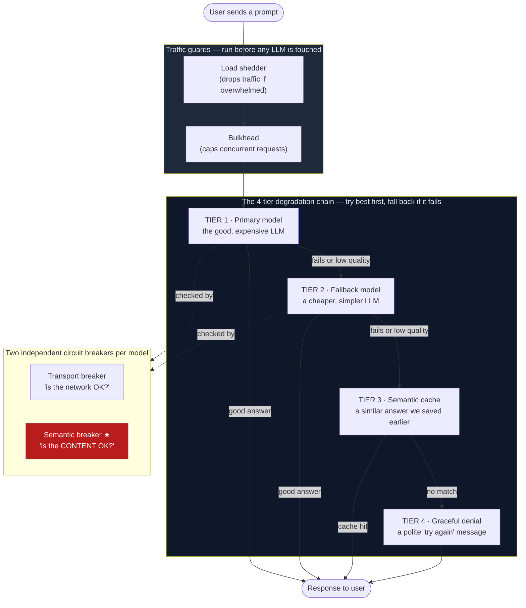

# AgentShield — Architecture Guide

This folder explains **what AgentShield is, what problem it solves, and how it
works inside** — written for someone who has never seen the project and is not
assumed to know the jargon. Every technical term is defined in the
[glossary](05-glossary.md); the first time a term appears in the other pages it
links there.

If you read nothing else, read this page. It gives you the whole picture in
about five minutes.

---

## The one-sentence version

> Your LLM returns `HTTP 200 OK`. The text it returns is garbage. Every existing
> safety tool thinks everything is fine. **AgentShield is the safety tool that
> notices the text is garbage and quietly fixes it before your user sees it.**

---

## Reading order

| # | Page | What it answers |
|---|------|-----------------|
| 1 | [The Problem](01-the-problem.md) | Why do LLMs need a *new kind* of safety net that didn't exist before? |
| 2 | [Architecture Overview](02-architecture-overview.md) | What are the moving parts, and how does a request flow through them? |
| 3 | [The Two Circuit Breakers](03-two-circuit-breakers.md) | The core idea: *why two* breakers, and how the "quality" one works. |
| 4 | [Request Lifecycle](04-request-lifecycle.md) | Follow one real request, step by step, from arrival to response. |
| 5 | [Glossary](05-glossary.md) | Every term, defined in plain English. |

---

## The big picture in one diagram

This is the whole system. Don't worry about the details yet — each box is
explained in the pages above. The point is the **shape**: a request enters at
the top, and instead of one path to the LLM, there are *layers of protection*,
and if the best path fails the request falls down to the next-best one.

★ The **semantic breaker** is the novel piece — the part no other resilience
library has. Everything else (load shedding, bulkheads, fallback, caching) is
well-established engineering. AgentShield's contribution is adding a circuit
breaker that trips on **answer quality**, not just network health.

---

## Why this matters for the hackathon

AgentShield is built for the **TrueFoundry Resilient Agents Challenge**. The
challenge brief names three ways an AI agent's infrastructure can fail:

| Failure the brief names | Plain English | Which part of AgentShield handles it |
|---|---|---|
| **LLM server outage** | The AI model's server is down (returns errors / times out) | Transport breaker + fallback tier |
| **LLM brownout** | The server is *up* but the answers have silently gone bad | **Semantic breaker** ← the unique part |
| **MCP server erroring** | An external tool the agent calls is broken | Per-tool breaker on the ReAct agent |

The middle row is the one nobody else solves. That's the whole pitch.

---

## Where the code lives

If you want to read the source while you read these docs:

| Concept in these docs | Source file |
|---|---|
| The 4-tier degradation chain | [`orchestrator/orchestrator.go`](../../orchestrator/orchestrator.go) |
| The semantic circuit breaker | [`quality/breaker.go`](../../quality/breaker.go) |
| The 5 quality signals | [`quality/evaluator.go`](../../quality/evaluator.go) |
| The ReAct agent + tools | [`agent/react.go`](../../agent/react.go), [`agent/tool.go`](../../agent/tool.go) |
| The semantic cache | [`cache/semantic.go`](../../cache/semantic.go) |
| The resilience score | [`telemetry/score.go`](../../telemetry/score.go) |
| HTTP endpoints | [`api/handler.go`](../../api/handler.go) |

The top-level [README](../../README.md) is the judge-facing pitch. **This folder
is the "explain it to me like I'm new" companion.**
